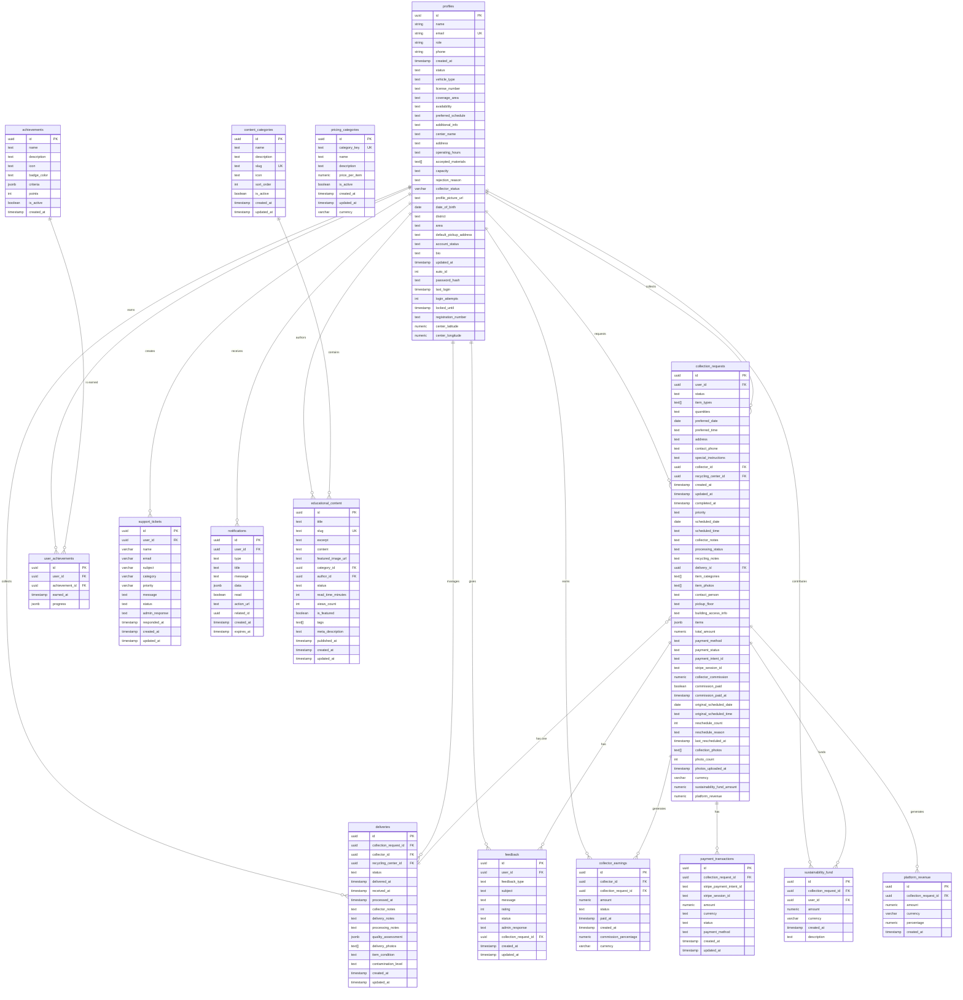

# EcoTech App - Entity Relationship Diagram (ERD)

This document provides a detailed breakdown of the EcoTech application's database schema, including its entities, attributes, and relationships. It concludes with a full Entity Relationship Diagram (ERD) generated using Mermaid syntax.

## 1. Entities

Entities are the main objects in your system, which correspond to the tables in your database.

-   **`profiles`**: The central entity representing all users (general users, collectors, recycling center staff). It's a polymorphic entity that holds data for different roles.
-   **`collection_requests`**: A core transactional entity that captures all details of a user's request to have e-waste collected.
-   **`deliveries`**: Tracks the physical delivery of collected items from a collector to a recycling center.
-   **`achievements`**: Defines the criteria for gamification badges and awards.
-   **`user_achievements`**: A linking table that connects users to the achievements they have earned.
-   **`feedback`**: Stores feedback provided by users, which can be general or tied to a specific collection request.
-   **`support_tickets`**: Manages user-submitted support requests and their resolution.
-   **`pricing_categories`**: A reference table for the pricing of different e-waste items for paid collections.
-   **`collector_earnings`**: Tracks the commission earned by collectors from paid collection requests.
-   **`payment_transactions`**: Records all payment-related transactions, primarily for paid collections.
-   **`notifications`**: Stores system-generated notifications for users.
-   **`sustainability_fund`**: Tracks contributions to the sustainability fund from collection payments.
-   **`platform_revenue`**: Tracks the revenue earned by the platform from collection payments.
-   **`content_categories`**: Organizes educational content into distinct categories.
-   **`educational_content`**: Stores articles and other educational materials.

## 2. Attributes

Attributes are the properties of each entity, which correspond to the columns in your tables. Below are the key attributes for each entity.

-   **`profiles`**: `id` (PK), `email` (UK), `role`, `status`. Contains role-specific attributes like `vehicle_type` (for collectors) and `center_name` (for recycling centers), which suggests an opportunity for normalization.
-   **`collection_requests`**: `id` (PK), `user_id` (FK), `collector_id` (FK), `status`, `items` (JSONB), `total_amount`, `payment_status`.
-   **`deliveries`**: `id` (PK), `collection_request_id` (FK), `collector_id` (FK), `recycling_center_id` (FK), `status`.
-   **`achievements`**: `id` (PK), `name`, `description`, `criteria` (JSONB).
-   **`user_achievements`**: `id` (PK), `user_id` (FK), `achievement_id` (FK).
-   **`feedback`**: `id` (PK), `user_id` (FK), `collection_request_id` (FK), `rating`, `message`.
-   **`support_tickets`**: `id` (PK), `user_id` (FK), `subject`, `category`, `status`.
-   **`pricing_categories`**: `id` (PK), `category_key` (UK), `name`, `price_per_item`.
-   **`collector_earnings`**: `id` (PK), `collector_id` (FK), `collection_request_id` (FK), `amount`, `status`.
-   **`payment_transactions`**: `id` (PK), `collection_request_id` (FK), `stripe_payment_intent_id`, `amount`, `status`.
-   **`notifications`**: `id` (PK), `user_id` (FK), `type`, `message`, `read`.
-   **`sustainability_fund`**: `id` (PK), `collection_request_id` (FK), `user_id` (FK), `amount`.
-   **`platform_revenue`**: `id` (PK), `collection_request_id` (FK), `amount`.
-   **`content_categories`**: `id` (PK), `slug` (UK), `name`.
-   **`educational_content`**: `id` (PK), `slug` (UK), `title`, `content`, `category_id` (FK), `author_id` (FK).

## 3. Relationships

Relationships define how entities are connected to each other, enforced by foreign keys.

-   **`profiles` and `collection_requests`**: One-to-Many. A profile can have many collection requests.
-   **`profiles` and `deliveries`**: One-to-Many. A profile (collector or recycling center) can be associated with many deliveries.
-   **`collection_requests` and `deliveries`**: One-to-One. Each collection request has exactly one delivery record.
-   **`profiles` and `user_achievements`**: One-to-Many. A user can have many achievements.
-   **`achievements` and `user_achievements`**: One-to-Many. An achievement can be earned by many users.
-   **`profiles` and `feedback` / `support_tickets` / `notifications`**: One-to-Many. A user can have many feedback entries, support tickets, and notifications.
-   **`collection_requests` and `feedback` / `collector_earnings` / `payment_transactions`**: One-to-Many. A collection request can be associated with feedback, earnings, and payment transactions.
-   **`content_categories` and `educational_content`**: One-to-Many. A category can contain many pieces of educational content.
-   **`profiles` and `educational_content`**: One-to-Many. A profile (author) can write many pieces of content.

## 4. Mermaid ERD Code

