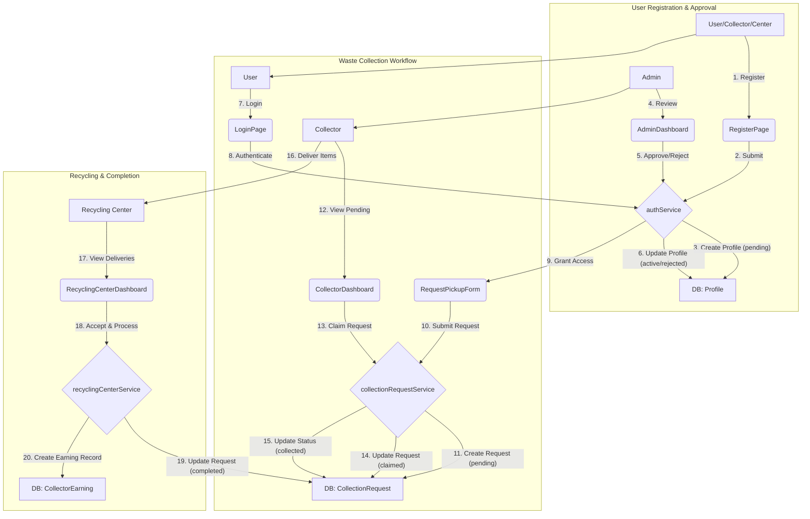

# EcoTech - Waste Management Platform

EcoTech is a modern, web-based platform designed to streamline waste collection and recycling processes. It connects users with collectors and recycling centers, creating an efficient and transparent system for managing waste.

## Key Features

- **Role-Based Dashboards:** Tailored dashboards for Admins, Collectors, Recycling Centers, and Public Users.
- **Waste Collection Requests:** Users can easily request waste pickup through an intuitive form.
- **Real-Time Tracking:** Track the status of collection requests from submission to completion.
- **Secure Authentication:** A robust user registration and authentication system with admin approval.
- **Interactive Map:** Find nearby recycling centers with ease.

## Tech Stack

- **Frontend:** React, Vite, Tailwind CSS
- **Backend & Database:** Supabase
- **Routing:** React Router
- **Mapping:** Leaflet

## Data Flow Diagram

The following diagram illustrates the primary user and data workflows within the EcoTech platform:



## Getting Started

### Prerequisites

- Node.js and npm
- A Supabase account and project

### Installation

1.  **Clone the repository:**
    ```bash
    git clone https://github.com/your-username/ecotech.git
    cd ecotech
    ```

2.  **Install dependencies:**
    ```bash
    npm install
    ```

3.  **Set up Supabase:**
    - Create a `.env` file in the root of the project.
    - Add your Supabase URL and Anon Key to the `.env` file:
      ```
      VITE_SUPABASE_URL=your-supabase-url
      VITE_SUPABASE_ANON_KEY=your-supabase-anon-key
      ```
    - Update the Supabase client initialization in `src/lib/supabase.js` to use these environment variables.

4.  **Run the development server:**
    ```bash
    npm run dev
    ```

The application will be available at `http://localhost:5173`.
